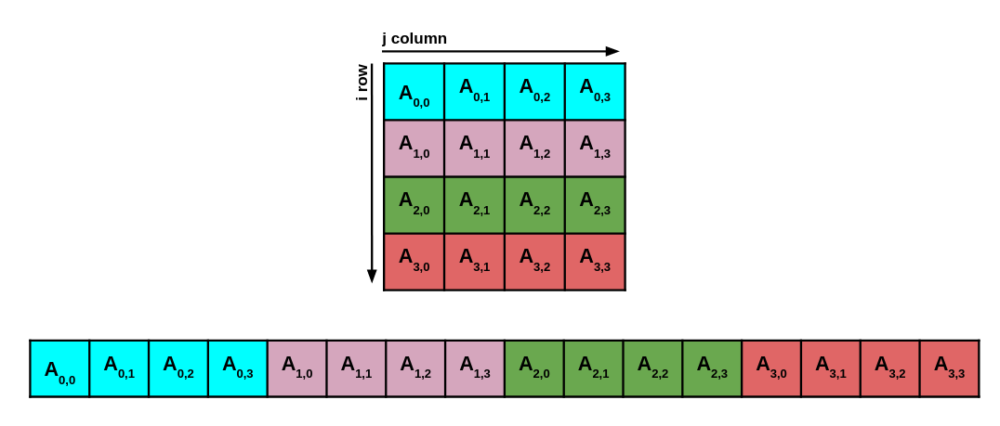

# HSF-India HEP Software Workshop at NISER 
## Introduction to GPU programming


### **Set-up instructions**

Start by launching the following notebook
```
https://binderhub.ssl-hep.org/v2/gh/research-software-collaborations/courses-hsf-india-december2023/gpugpu_true
```

### **Getting familiar with the GPU** 
Lets check how many / what type of GPUs are available in the system. To do this, simply run :
```
nvidia-smi
```
**Lets try to answer some questions :**
1. How many GPUs does the system have?
2. What type of GPUs does the system have?
3. What is the GPUs global memory?

## **Exercise 1:** "Hello world" with CUDA
During the lecture we saw a "Hello World" CUDA kernel. Lets try and run it ourselves! To compile and run the *cuda_hello.cu* CUDA script simply do :

```
nvcc cuda_hello.cu -o cuda_hello -gencode=arch=compute_61,code=sm_61
./cuda_hello
```
**Lets try and answer some questions :**
1. What do you observe? 
2. Why is this happening?
3. What can we do to fix this?

If you get stuck you can take a look at the *cuda_hello.cu* script in the *solutions* directory.

## **Exercise 2 :** Matrix multiplication on the GPU
Goal of this excersise is to write a CUDA kernel that performs a 2-dimensional square matrix multiplication on the GPU. 
- Start by taking a look at the file **matrix_multiplication.cu**.  
- We can respresent the 2-D matrix in 1-D as shown in the image below. This will make copying the matrix from the host to device and from device to host easier. The size of each matrix is DSIZE*DSIZE.


- Find and properly update all parts of the script denoted with **FIXME**.

To compile and run the CUDA script you can do :
```
nvcc matrix_multiplication.cu -o matrix_multiplication -gencode=arch=compute_61,code=sm_61
./matrix_multiplication
```
**Lets try and answer some questions :**
- Compare the time it takes to perform the matrix multiplication on the CPU and the GPU. 
  - What do you observe? (Keep in mind that you are running on shared resources. You can try invoking the program a few times and then select the best run.)
- Try changing the size of the matrix by mutiplying *DSIZE* by 2,4, and 8.
  - What do you observe now? How does the CPU and GPU time scale? 

If you get stuck you can take a look at the *matrix_multiplication.cu* script in the *solutions* directory.

